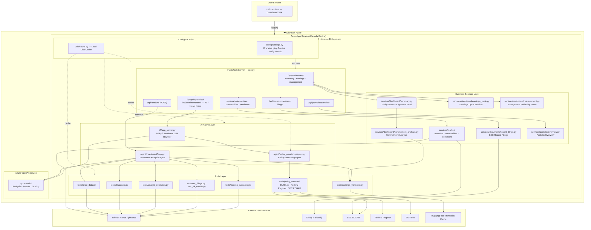
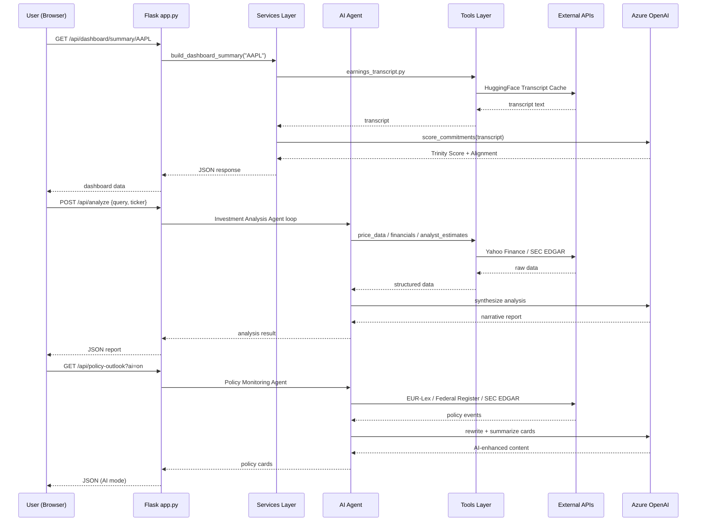

# OpenOctopus

An institutional-grade equity intelligence platform combining a **deterministic Python backend** with an **optional AI overlay**. It surfaces earnings history, management credibility signals, analyst consensus, and macro/policy context into a single unified dashboard.

**Target user:** Professional investors, fund analysts, and wealth advisors who need data-dense, trustworthy financial signals without noise.

---

## System Architecture



---

## Request Flow



---

## Responsibility Split

| Capability | Python (Deterministic) | AI (LLM) |
|---|---|---|
| Stock price & volume | `tools/price_data.py` | — |
| Moving average signals | `tools/moving_averages.py` | — |
| Key financials (PE, EPS, FCF) | `tools/financials.py` | — |
| Analyst estimates & beat/miss | `tools/analyst_estimates.py` | — |
| Earnings transcript fetch | `tools/earnings_transcript.py` | — |
| SEC 10-K / 10-Q summary | `tools/sec_filings.py` | — |
| 8-K event classification | `tools/sec_8k_events.py` | — |
| Policy event ingestion | `tools/policy_sources/` | — |
| Commitment scoring | — | `gpt-4o-mini` |
| Natural language analysis | — | Investment Agent |
| Policy card rewrite (AI mode) | — | LLM Rewriter |
| Tool dispatch strategy | — | Agent loop |

---

## Quick Decision

- **Need raw data & metrics** → Python tools work standalone
- **Need analyst-quality conclusions** → AI required

---

## Project Structure

```
OpenOctopus/
├── app.py                    # Flask server (port 5000), all API routes
├── main.py                   # CLI REPL (legacy)
├── requirements.txt
├── startup.txt               # Gunicorn startup command for Azure
├── agent/
│   ├── investment/           # Investment Analysis Agent loop
│   └── policy_monitoring/    # Policy Monitoring Agent + rules
├── config/
│   ├── settings.py           # Environment config & API keys
│   ├── management_scoring.py
│   └── ui_data_contracts.py
├── data_sources/
│   ├── market/               # Yahoo Finance, Stooq adapters
│   └── transcripts/          # HuggingFace transcript cache
├── services/
│   ├── dashboard/            # summary, earnings_cycle, management, commitment_analysis
│   ├── documents/            # recent_filings
│   ├── market/               # overview, commodities, sentiment
│   └── portfolio/            # overview
├── tools/                    # All callable tools (dispatcher, price, financials, …)
├── UI/
│   ├── index.html            # Dashboard SPA (Tailwind CSS)
│   └── app_server.py         # Policy/Sentiment LLM rewriter helpers
├── utils/
│   ├── cache.py              # Local disk cache
│   └── formatting.py
└── Test/                     # 96 pytest tests
```

---

## Running Locally

```powershell
# Install dependencies
cd C:\Case\Case_AI_Challenge\Optopus_2\OpenOctopus
.\.venv\Scripts\python.exe -m pip install -r requirements.txt

# Start the web server
.\.venv\Scripts\python.exe app.py
# → http://127.0.0.1:5000
```

---

## Running Tests

```powershell
.\.venv\Scripts\python.exe -m pytest Test -q
# 96 passed
```

---

## Full Integration Self-Test (PowerShell one-liner)

```powershell
Set-Location C:\Case\Case_AI_Challenge\Optopus_2\OpenOctopus; .\.venv\Scripts\python.exe -m pip install -r requirements.txt; .\.venv\Scripts\python.exe -m pip install pytest; .\.venv\Scripts\python.exe -c "from tools.dispatcher import dispatch; tests=[('get_stock_price',{'ticker':'AAPL'}),('get_moving_average_signals',{'ticker':'AAPL'}),('get_key_financials',{'ticker':'AAPL'}),('get_analyst_estimates',{'ticker':'AAPL'}),('get_earnings_transcript',{'ticker':'AAPL'}),('get_recent_8k_events',{'ticker':'AAPL','lookback_count':5}),('get_sec_filing_summary',{'ticker':'AAPL','filing_type':'10-K'}),('query_policy_updates',{'jurisdiction':'US','keyword':'export controls','from_date':'2025-01-01','to_date':'2026-04-18','limit':2})]; import sys; ok=True; [print(f'{n}:', 'OK' if 'error' not in (r:=dispatch(n,i)) else 'ERROR', '' if 'error' not in r else r['error'][:160]) or (ok:=ok and ('error' not in r)) for n,i in tests]; sys.exit(0 if ok else 1)"; .\.venv\Scripts\python.exe -m pytest -q Test
```

---

## Deployment (Azure App Service)

Start command (`startup.txt`):
```
gunicorn --bind=0.0.0.0:8000 --timeout 120 app:app
```

Required environment variables:
- `OPENAI_API_KEY`
- `AZURE_OPENAI_ENDPOINT`
- `AZURE_OPENAI_API_KEY`
- `MODEL` (e.g. `gpt-4o-mini`)
- `SCM_DO_BUILD_DURING_DEPLOYMENT=true`

---

## API Reference

| Method | Endpoint | Description |
|---|---|---|
| GET | `/` | Dashboard UI (index.html) |
| GET | `/api/health` | Health check |
| GET | `/api/dashboard/summary/<ticker>` | Trinity Score + Alignment |
| GET | `/api/dashboard/earnings/<ticker>` | Earnings Cycle Window |
| GET | `/api/dashboard/management/<ticker>` | Management Reliability |
| GET | `/api/market/overview` | S&P 500, NASDAQ, VIX |
| GET | `/api/market/commodities` | Brent crude, Gold |
| GET | `/api/market/sentiment` | Fear/Greed composite |
| GET | `/api/portfolio/overview` | Portfolio summary |
| GET | `/api/documents/recent-filings` | Recent SEC filings |
| POST | `/api/analyze` | AI investment analysis |
| GET | `/api/policy-outlook?ai=on\|off` | Policy cards (AI or deterministic) |
| GET | `/api/sentiment-feed?ai=on\|off` | Sentiment feed (AI or deterministic) |

